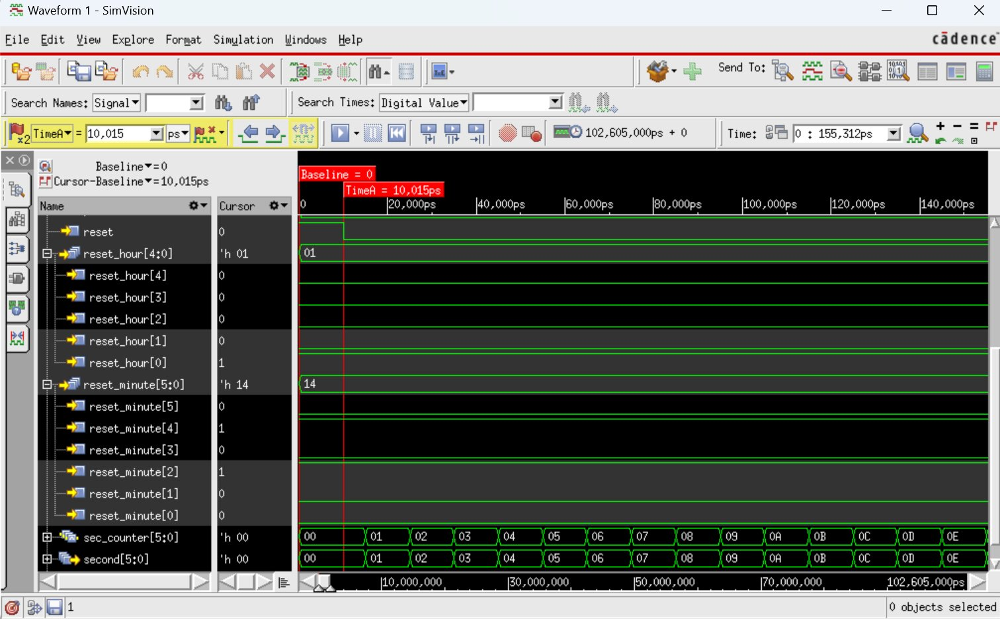
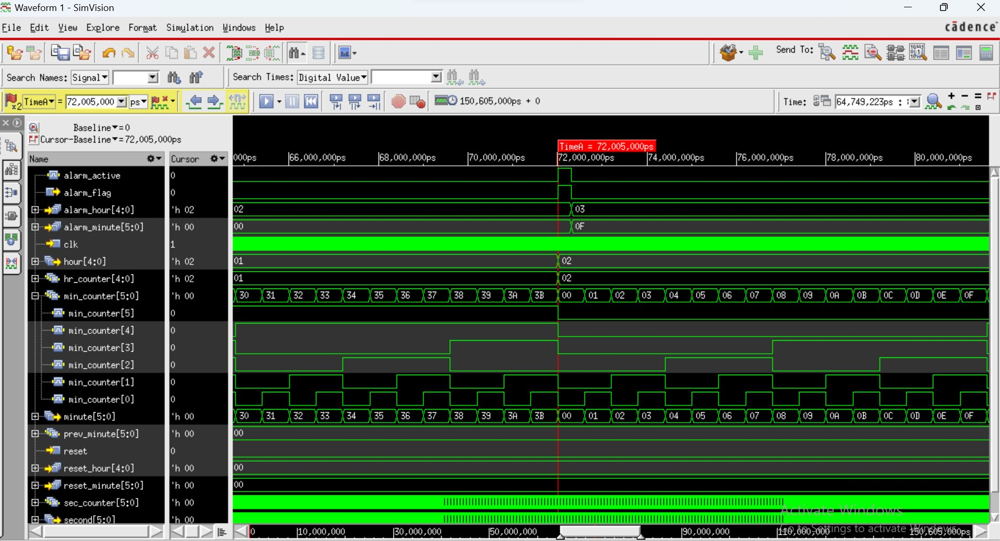
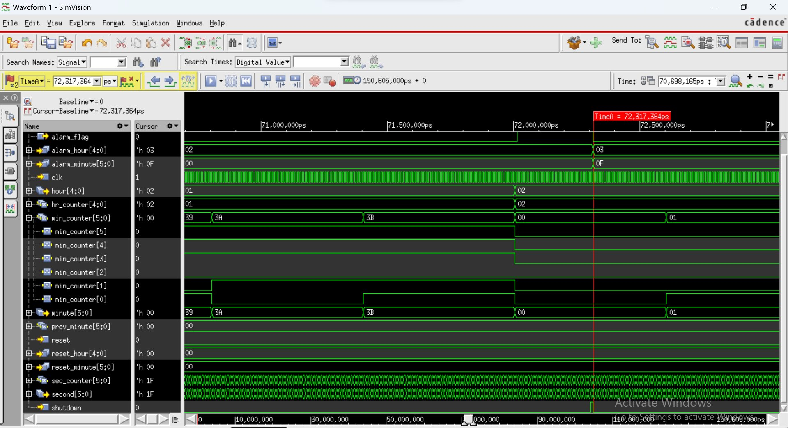
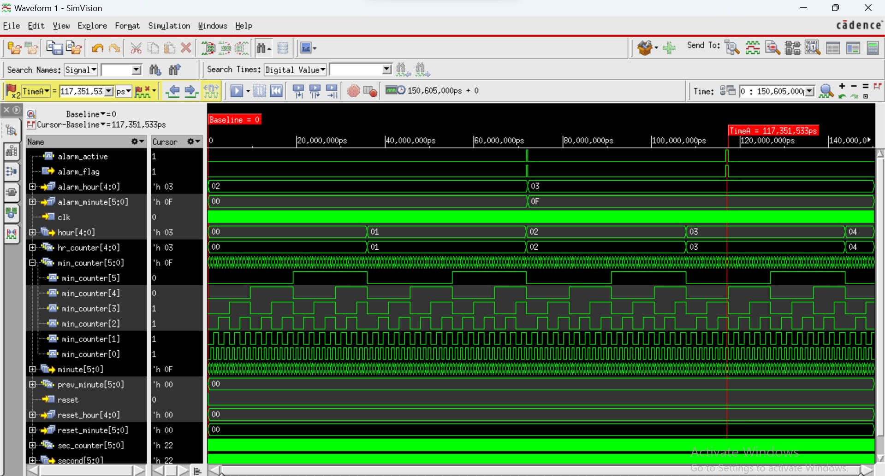
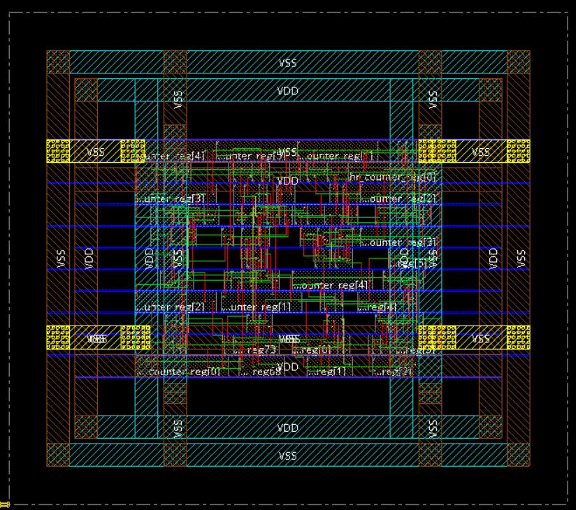

# `digi-alrm-clk`
### A Synthesizable Digital Alarm Clock in Verilog HDL

[](https://en.wikipedia.org/wiki/Verilog)
[](#toolchain)
[](#simulation--verification)
[](#physical-design)

</div>

---

## Abstract

This repository implements a **register-transfer-level digital alarm clock** in Verilog, from RTL design through functional simulation, gate-level synthesis (Cadence Genus), and physical layout (Cadence Innovus). The design uses cascaded second/minute/hour counters, exposes a synchronous reset to set the clock, and drives an `alarm_flag` output when the current time matches a user-programmed alarm time, with a manual `shutdown` override. The full flow — from HDL to a DRC-clean layout — is documented below with waveform and layout evidence pulled directly from the project's verification runs.

---

## Table of Contents

1. [System Overview](#1-system-overview)
2. [Module Interface](#2-module-interface)
3. [Design Equations & Internal State](#3-design-equations--internal-state)
4. [Architecture](#4-architecture)
5. [Simulation & Verification](#5-simulation--verification)
6. [Physical Design](#6-physical-design)
7. [Repository Structure](#7-repository-structure)
8. [Getting Started](#8-getting-started)
9. [Future Work](#9-future-work)

---

## 1. System Overview

A digital clock reduces timekeeping to a chain of modular counters driven by a single reference edge. This project's objectives were threefold:

> **(i) Real-time timekeeping** — continuously update $\{s, m, h\}$ with correct rollover;
> **(ii) Reset** — force the clock into a user-specified state $(m_0, h_0)$ with $s \leftarrow 0$;
> **(iii) Alarm** — raise a flag when the live time matches a programmed target, and allow manual dismissal via `shutdown`.

All logic is described in synthesizable, edge-triggered Verilog (`alarm_clk.v`) and exercised by a self-checking testbench (`tb_alarm_clk.v`) running on a 100 MHz simulation clock (the real-time target is 1 Hz; 100 MHz is used purely to accelerate simulation).

## 2. Module Interface

```verilog
module alarm_clk (
    clk, reset, shutdown, reset_minute, reset_hour, alarm_minute, alarm_hour,
    second, minute, hour, alarm_flag
);
```

| Port | Direction | Width | Description |
|---|---|:---:|---|
| `clk` | input | 1 | System clock |
| `reset` | input | 1 | Asynchronous reset — loads `reset_hour` / `reset_minute` |
| `shutdown` | input | 1 | Manual alarm-dismiss button |
| `reset_hour` | input | 5 | Hour to load on reset, $0 \le h_0 \le 23$ |
| `reset_minute` | input | 6 | Minute to load on reset, $0 \le m_0 \le 59$ |
| `alarm_hour` | input | 5 | Target alarm hour |
| `alarm_minute` | input | 6 | Target alarm minute |
| `second` | output | 6 | Live seconds, $0$–$59$ |
| `minute` | output | 6 | Live minutes, $0$–$59$ |
| `hour` | output | 5 | Live hours, $0$–$23$ |
| `alarm_flag` | output (reg) | 1 | High while the alarm is active |

## 3. Design Equations & Internal State

The counters roll over according to the standard base-60 / base-24 timekeeping relations, evaluated on every rising edge of `clk`:

$$
s_{t+1} =
\begin{cases}
0, & s_t = 59 \\
s_t + 1, & \text{otherwise}
\end{cases}
\qquad
m_{t+1} =
\begin{cases}
0, & s_t = 59 \wedge m_t = 59 \\
m_t + 1, & s_t = 59 \wedge m_t \ne 59 \\
m_t, & \text{otherwise}
\end{cases}
$$

$$
h_{t+1} =
\begin{cases}
0, & s_t = 59 \wedge m_t = 59 \wedge h_t = 23 \\
h_t + 1, & s_t = 59 \wedge m_t = 59 \wedge h_t \ne 23 \\
h_t, & \text{otherwise}
\end{cases}
$$

The alarm is a level-sensitive comparator latched by an internal `alarm_active` state bit, so it fires exactly once per match rather than re-triggering every cycle the time equality holds:

```math
\text{alarm\_flag}_{t+1} =
\begin{cases}
0, & \text{shutdown} \wedge \text{alarm\_active}_t \\
1, & (h_t = h_{\text{alarm}}) \wedge (m_t = m_{\text{alarm}}) \wedge \lnot\,\text{alarm\_active}_t \\
0, & (h_t \ne h_{\text{alarm}}) \vee (m_t \ne m_{\text{alarm}}) \\
\text{alarm\_flag}_t, & \text{otherwise}
\end{cases}
```


## 4. Architecture

The design is split into three concurrent `always` blocks sharing the same clock and reset:

1. **Timekeeping** — cascaded `sec_counter → min_counter → hr_counter` with carry-based rollover.
2. **Alarm logic** — compares `{hour, minute}` against `{alarm_hour, alarm_minute}` and manages the `alarm_active` latch so the flag transitions cleanly on match, shutdown, or time drift.
3. **Output assignment** — combinational `assign` of the internal counters to `second` / `minute` / `hour`.

This partition kept each concern independently testable before integration, following the project's iterative build-and-verify methodology.

## 5. Simulation & Verification

Verification used the testbench in `tb_alarm_clk.v` against Cadence SimVision, covering reset, two independent alarm events, a mid-alarm shutdown, and automatic alarm timeout.

### 5.1 Reset behaviour

Reset immediately forces the display to the programmed `reset_hour` / `reset_minute` with seconds cleared, independent of prior state.

<p align="center">
  
  <br/><sub><b>Fig. 1</b> — Reset loads the clock to <code>hour = 1</code>, <code>minute = 20</code>, <code>second = 0</code>.</sub>
</p>

### 5.2 Alarm trigger and manual shutdown

Alarm 1 was programmed for **02:00**. `alarm_flag` rises on match and stays high until the `shutdown` pulse arrives at second 30, at which point it is cleared immediately — well short of the nominal 60-second window — demonstrating that `shutdown` pre-empts the timeout.

<p align="center">
  
  <br/><sub><b>Fig. 2</b> — <code>alarm_flag</code> asserted the instant <code>{hour, minute}</code> matches <code>{alarm_hour, alarm_minute}</code>.</sub>
</p>

<p align="center">
  
  <br/><sub><b>Fig. 3</b> — A <code>shutdown</code> pulse clears <code>alarm_flag</code> and <code>alarm_active</code> on demand.</sub>
</p>

### 5.3 Automatic deactivation

Alarm 2, programmed for **03:15** with no shutdown applied, confirms the complementary path: the flag self-clears once the minute counter advances past the match, with no manual intervention needed.

<p align="center">
  
  <br/><sub><b>Fig. 4</b> — Alarm 2 fires at <code>03:15</code> and deactivates automatically once the minute rolls to <code>03:16</code>.</sub>
</p>

### 5.4 Observation summary

| Hour (5b) | Minute (6b) | Second (6b) | `alarm_flag` | `shutdown` | Event |
|:---:|:---:|:---:|:---:|:---:|---|
| `00010` | `011110` | `000000` | 1 | 0 | Alarm 1 fires at 2:30 |
| `00010` | `011110` | `011110` | 0 | 1 | Manual shutdown at 2:30:30 |
| `00011` | `001111` | `000000` | 1 | 0 | Alarm 2 fires at 3:15 |
| `00011` | `010000` | `000000` | 0 | 0 | Alarm 2 auto-clears at 3:16 |

All transitions were glitch-free across resets, back-to-back alarms, and shutdown events.

## 6. Physical Design

Beyond RTL simulation, the design went through **Genus** RTL synthesis (generic mapping to a slow/fast standard-cell library) and **Innovus** place-and-route, producing a DRC-clean, fully routed layout with no orphan nets or inferred latches.

<p align="center">
  
  <br/><sub><b>Fig. 5</b> — Placed-and-routed layout (Cadence Innovus): power rails (<code>VDD</code>/<code>VSS</code>) and the second/minute/hour counter register banks.</sub>
</p>

Timing closure was verified against the slow-corner library, with setup checks passing across all reg-to-reg and default paths; connectivity verification and the DRC deck reported zero violations.

## 7. Repository Structure

```text
digi-alrm-clk/
├── alarm_clk.v          # Synthesizable RTL: timekeeping, alarm, and reset logic
├── tb_alarm_clk.v        # Self-checking testbench (100 MHz sim clock)
├── assets/               # Waveform & layout figures used in this README
└── README.md
```

## 8. Getting Started

```bash
# Simulate with Icarus Verilog + GTKWave
iverilog -o sim.out alarm_clk.v tb_alarm_clk.v
vvp sim.out
gtkwave alarm_clk.vcd
```

The testbench drives two alarm scenarios (02:00 with shutdown, 03:15 without) and prints a `$display` trace of `{hour, minute, second, alarm_flag}` at each key transition.

## 9. Future Work

- Stopwatch mode with independent start/stop/lap control
- Multi-alarm scheduling (beyond a single `{alarm_hour, alarm_minute}` pair)
- Snooze: temporary dismiss with automatic re-trigger after a fixed delay
- Ambient light control tied to time-of-day
- Low-power optimisation for battery-operated, real-time (1 Hz) deployment

---

<div align="center"><sub>Simulated in Cadence SimVision · Synthesized with Genus · Placed &amp; routed in Innovus</sub></div>
